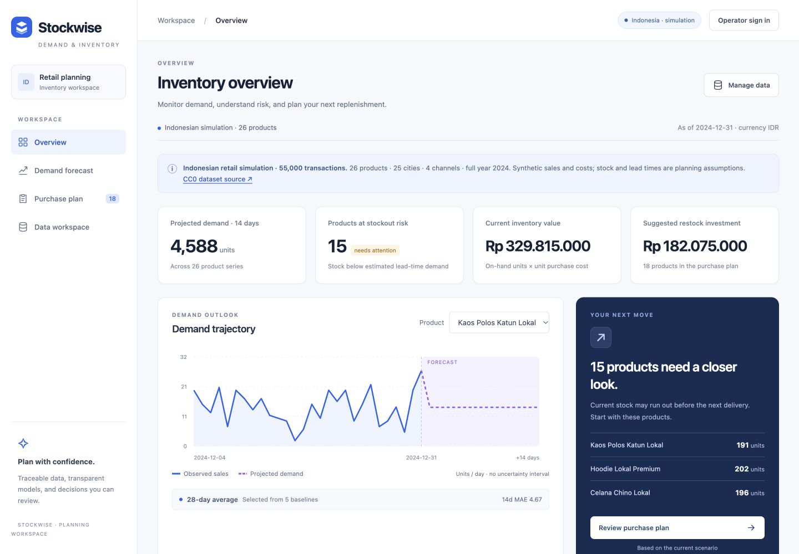

# Stockwise

Demand forecasting and inventory planning with traceable datasets, explainable baselines and reviewable replenishment recommendations.

[Live demo](https://desta-data-analytics.github.io/stockwise/) · [Repository](https://github.com/Desta-data-analytics/stockwise)



## Run
Requires Node 20.19+ or 22. No package installation or API key is needed.

```sh
npm run dev
```

Open http://127.0.0.1:4173. New public workspaces explore Indonesian simulated sales (UCI real UK sales remains selectable); private operator access is disabled until configured. For persistent server workspace, copy .env.example to .env, run `npm run password` privately, set the returned OPERATOR_PASSWORD_HASH and restart. Never commit a password/hash. Use explicit Save workspace after signing in.

```sh
npm test
npm run check
npm run build
```

## Features
- 55,000 Indonesian simulated transactions → 26 products × 366 days in IDR, with CC0 provenance and reproducible Python preparation.
- 12 real UCI product series × 183 calendar days, with provenance, source/license attribution and reproducible preparation.
- Five baseline models evaluated at rolling 7/14/28-day origins; MAE/WAPE computed from historical held-out data.
- Forecast visualization, inventory risk, adjustable stock/cost/lead time and demand scenarios.
- Validated CSV ingestion, formula-safe exports and selectable imported-data currency; no implicit FX conversion.
- Guest browser persistence and authenticated server persistence with revision conflict handling, atomic writes and previous revision.
- Production configuration validation, CSP, origin/CSRF enforcement, limited operator sessions, login rate limiting, nonroot Docker image and CI configuration.

## Documents
[PRD](docs/PRD.md) · [Design system](docs/DESIGN_SYSTEM.md) · [Architecture](docs/ARCHITECTURE.md) · [Dataset](docs/DATASET.md) · [Deployment](docs/DEPLOYMENT.md) · [Verification](docs/VERIFICATION.md) · [AI agents](docs/AI_AGENTS.md) · [Portfolio case study and post draft](docs/PORTFOLIO_CASE_STUDY.md).

## Scope and attribution
Single operator, one workspace, one process with a persistent volume. Not a multi-tenant SaaS. Indonesian default sales/costs are explicitly synthetic; UCI comparison sales are real historical observations. Inventory and supplier lead times are planning assumptions. Server data is private to the operator; guest exploration is separate. No automatic purchases or external AI provider.

Dataset: Chen, D. (2015), Online Retail, UCI Machine Learning Repository, https://doi.org/10.24432/C5BW33. CC BY 4.0. This derivative aggregates and filters transactions. See docs/DATASET.md and public/data/provenance.json. No raw customer identifiers are bundled.

Deployment still requires HTTPS, secrets, durable volume and tested off-host backup/recovery. Local tests do not prove live hosting, HA, or independent security certification.

## Public hosting
GitHub Pages runs the static guest demo. It stores data in the visitor browser and has no operator API. `npm run build:pages` prepares `/stockwise/`; pushes to main run validation and the Pages workflow. Node operator deployment remains separate.
